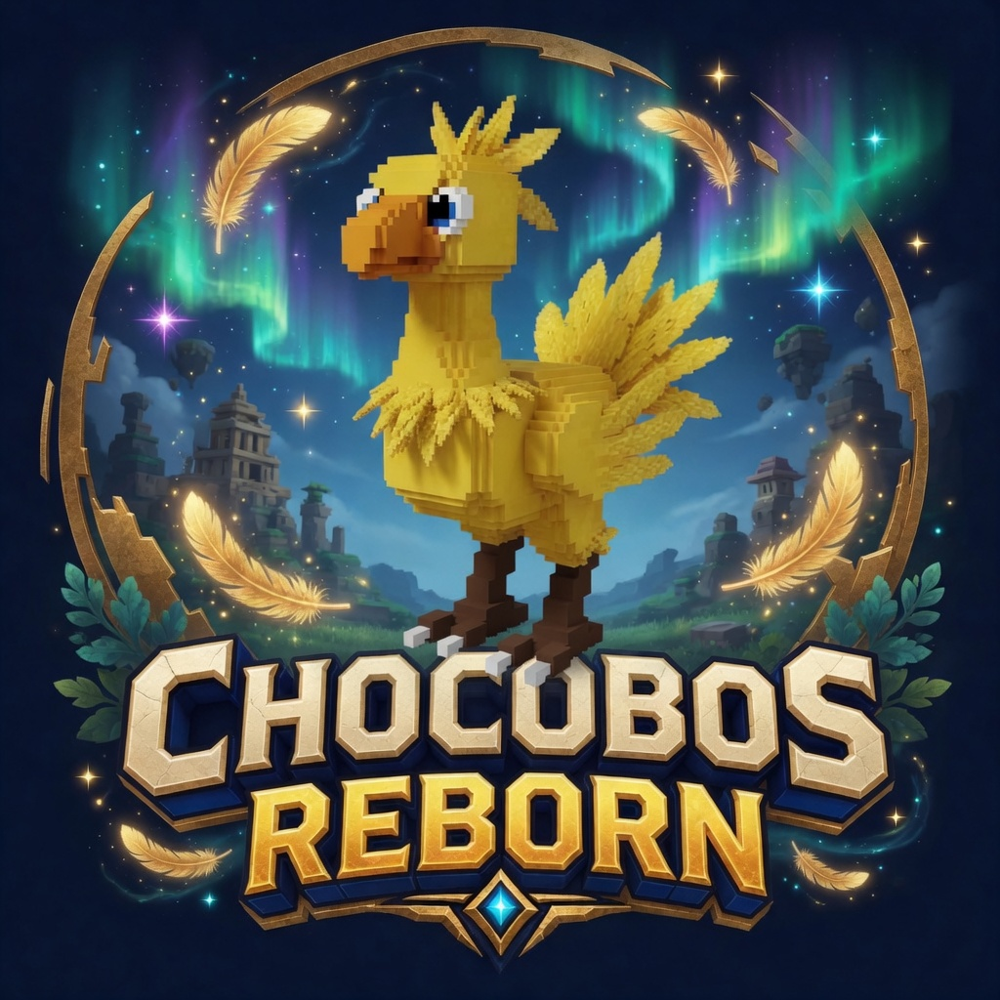
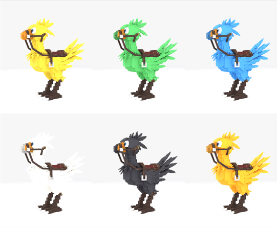

  

# Chocobos Reborn

Final Fantasy VII chocobos for **Minecraft 1.21.1 / NeoForge 21.1.249**. Version **1.1.5**. Catch a wild Yellow with Gysahl Greens, train it on the eight greens, mate it with the eight nuts, walk the farm line to Green, Blue, Black and Gold, then take it to Whiskerwind and race.

[CurseForge](https://www.curseforge.com/minecraft/mc-mods/chocobos-reborn) · [1.1.5 development notes](docs/RELEASE_1.1.5.md)

Original work. Original birds, original calls, original art, original music. A fan work, not affiliated with Square Enix.

  

## The birds

Adults stand about twice a player's height, crest to claw. Chicobos hatch small and grow through three stages. Eight plumages: Yellow, Green, Blue, White, Black, Gold, the End bird in purple with end-stone feathers, and the Nether bird in red with lava feathers. Females wear a shorter crest.

Craft a **Chocobo Almanac** (a book and a gysahl): the full guide, plus a live page for every bird you own with its genes, training, racing record and family line, with rename, release and remove.

Tame birds take three orders from the tabs on their equipment screen (sneak and right-click with an empty hand): **Follow** you (and come along to Whiskerwind and back), **Stay** put, or **Wander** within 24 blocks of where you left them. A plain right-click still sits a bird down or stands it back up.

Wild Yellows roam the Overworld. Wonderful Yellows only turn up on snow and ice. Nether birds are born in the Nether, End birds on the End's outer islands. Hold a **Chocobo Lure** and wild birds come to you and glow.

## Greens (training)

Gysahl, Krakka, Tantal, Pahsana, Curiel, Mimett, Reagan, Sylkis. Gysahl tames a wild bird (about one try in three) and heals a hurt one. Every green trains speed, stamina, intelligence or cooperation; a bird takes one training green every five minutes, and gets sated on each kind, so move up the ladder. Speed training makes a real difference: a fully trained bird runs a third faster. Gysahl grows from seeds found in grass and is the only green found in the wild; Krakka and Tantal can be crafted from it, and every other green comes from Sage Wynn in Whiskerwind or race prizes.

Every green also heals a hurt bird a little, restores stamina, grows a chicobo faster, and a sated bird gets one feed of each green back per day.

## Nuts (mating)

Pepio, Luchile, Saraha, Lasan, Pram, Porov, Carob, Zeio. Feed a nut to each of two owned adults of opposite sex and they mate. Plain nuts hatch a chicobo of the parents' colour. **Carob** and **Zeio** change the line:

1. Two **Good**-or-better Yellows + Carob → **Green** (mountain) or **Blue** (river).
2. **Great** Green + **Great** Blue + Carob → **Black**. A missed roll hatches **White**.
3. **Wonderful** Black + **Wonderful** Yellow + **Zeio** → **Gold**. Gold never hatches without Zeio.

As in FF7, colour breeding needs racers: both parents must have ranked first-place finishes in Whiskerwind, won in the step's own class, before a Carob or Zeio can change the line: 5 Class C wins each for Green or Blue, 8 Class B wins each for Black, 10 Class A wins each for Gold. More wins in that class make the roll surer until it is certain (16, 24 and 32 between the pair). The End and Nether birds breed true; no nut turns them into a farm-line colour. No nut is found in the wild: Bilo the Nutkeeper in Whiskerwind sells all eight. Race wins also pay Carob: 15% of the time at Class B, 40% at Class A, and first or second place in a ranked Class S heat, with a rare Zeio on a Class S win.

## Riding and fighting

Craft a **Chocobo Saddle**, put it on an owned adult and right-click to ride. Sprint to dash on stamina; ease off to recover. You can fight from the saddle: your swings and arrows never touch your own bird. Terrain follows FF7:

- **Green** climbs mountains
- **Blue** walks on shallow rivers; the rider breathes underwater
- **White** climbs and crosses shallow water
- **Black** climbs, crosses shallow water and sees at night
- **Gold** does everything, crosses lava and the ocean, and flies (hold jump to flap, look up while moving to climb, hold sprint to dive). Only Gold flies.
- **End bird** climbs, crosses any water, rider water breathing and slow falling
- **Nether bird** shrugs off fire and walks on lava, sharing fire resistance with the rider

Sprint dives a flier; sneak ducks a water bird under. You can only sneak-dismount on solid ground. Your crosshair passes through the bird while riding, so doors and blocks work from the saddle; sneak to target the bird (empty hand opens equipment).

Sneak-click your bird with an empty hand (or press your inventory key while riding) for its equipment: a saddle slot, an armor slot and **Saddlebags** (fifteen slots, named on an anvil). **Chocobo Armor** comes in leather, iron, diamond and netherite; iron and diamond birds wear it visibly. Armored birds cannot race.

## Whiskerwind

A race town on a sky island in the void, with its own day and night sky and its own music. Reach it with a **Chocobo Pocketwatch** or through the **Farmhand** at any Chocobo Farm, on foot or in the saddle; your birds nearby come along. Nothing spawns there and nothing there can be dug up.

The town: a plaza round the arrival medallion, the chocobo fountain, awninged market stalls, eight timber cottages, an inn with a copper-capped bell tower, the Race Hall, a stable yard, a windmill, a ranch where the town flock grazes, a nest barn with a chicobo nursery, a jockey lounge, a pond, an orchard, the gatehouse and its overlook, a winners' board, and a shrine islet. Ten townsfolk keep their own day, and when a heat is called the inn bell rings and they line the overlook to cheer.

**Heats go off every five minutes.** Esther on the overlook enters you in the next heat of your bird's class or any class below: the first rider picks the course, riders of that class or higher who see her join, taking an AI racer's stall. You may race any course of your class or below (lower classes pay half and don't count toward promotion). She calls the heat at two minutes and one minute, counts the last ten seconds, and you are carried to the stalls for a big five-second countdown.

**Forty-eight courses**, twelve per class (six sprints, six grands prix), every one a different circuit: sprints of one long lap and grands prix of three, four or five laps of a shorter circuit (the most laps on the shortest), with straights, sweepers, hairpins, chicanes and hills, striped kerbs, grandstands full of fans inside and outside the loop (three on a Class C course, ten on Class S), themed from meadow and shore through canyon, snow, cavern, jungle and the Nether to a rainbow skyway, an obsidian keep and the End. **Boost strips** cover one lane of the road, five on a sprint's long lap and three on a grand prix's short one, each on a corner exit; water, ridges, lava and bogs cross the direct line with a slower road round, laid on a bend so the way round really costs you and the bird that suits the terrain takes the short way. Every course has its own landmark, from a windmill and a beached shipwreck to a bone arch, a ring hung over the road and a caged crystal. Nothing in Whiskerwind can hurt a rider or a bird: a bad line costs a place, not a life. Six racers, every AI bird with a kin jockey up; from Class B on, Jolo and Teiyo are in the field, pacing themselves off your own bird, and every racer runs its own form each heat.

- **Rook the Bookie** takes one bet per heat.
- **Sable the Duel Master** runs two-rider races outside the ladder with an optional GP side bet.
- **Pell the Broker** swaps birds between players or hands over a gift.
- Stalls, all priced in **GP**: Sage Wynn (greens), Bilo the Nutkeeper (nuts), Tack (saddles, lures), the Fair (the Almanac, pocketwatches, fireworks, leads) and **Marl's GP Exchange**.

Classes run C → B → A → S. A ranked win scores by distance: a sprint is 4 points, a grand prix more the longer its heat, and the purse grows the same way. 36 points promote (nine sprint wins, or fewer grands prix). A bird never drops a class.

## Chocobo Farm

Farms dot the plains, meadows, savannas and cherry groves: a barn, a paddock with a couple of wild Yellows, a gysahl patch, a Stablehand who sells Gysahl and seeds, and a Farmhand at the gate who sends you to Whiskerwind.

## Start your journey

1. Find **Gysahl Seeds** in grass and grow a patch.
2. Tame a wild Yellow with Gysahl Greens.
3. Craft a **Chocobo Saddle** and ride.
4. Craft a **Chocobo Lure** to draw the next wild bird.
5. Craft a **Chocobo Pocketwatch**, or see a Farmhand, and race. Colour breeding needs those firsts.
6. Spend GP on better greens and nuts. Walk the farm line toward Gold.

Advancements track the whole line: first tame, first ride, first hatch, Green or Blue, Black, Gold, finding a farm, reaching Whiskerwind, a first-place finish and Class S.

## Requirements

| | |
|---|---|
| **Minecraft** | 1.21.1 |
| **Loader** | NeoForge **21.1.249** |
| **Java** | 21 |
| **Side** | Client + Server |

No other mods required. Works standalone. In [Ninjacat Skies](https://www.curseforge.com/minecraft/modpacks/ninjacat-skies) it sits beside [Tribal Power](https://www.curseforge.com/minecraft/mc-mods/tribalpower): the Whiskerwind keepers, crowd and jockeys wear Tribal Kin looks and the sky is the March's. The pack is optional.

## Build

Java 21. `./gradlew test`, `./gradlew runVerification` (headless GameTests), then `./gradlew build`. The jar is `build/libs/chocobosreborn-<version>.jar`.

## License

Chocobo is Square Enix intellectual property. This is a fan work and does not claim that IP. Nothing from Square Enix is shipped: birds, calls, item art and music are original. Code is MIT. Art and music are CC-BY-SA 4.0.

Created by Ahmi Darrow.

Latency work and remaining coverage: [improvement tracker](docs/LATENCY_IMPROVEMENTS.md). Run real client races with `python tools/latency_harness.py`, then six-racer heats (one host, two delayed guests, three AI) across all C/B/A/S tracks with `python tools/paired_race_harness.py --rtt 150 --rtt2 300`. Setup, results and limitations are described in the tracker.
